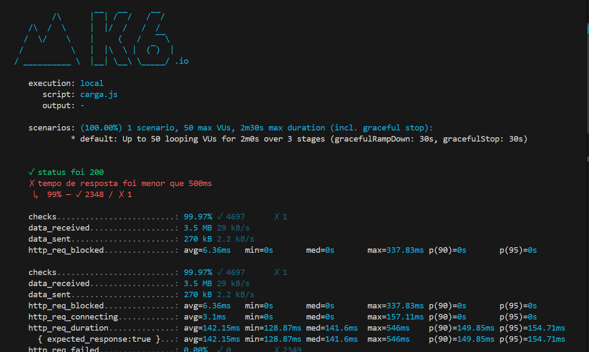

# Testes de Carga com k6 Usando TDD

## Introdução

O **Desenvolvimento Orientado a Testes (TDD)** é uma metodologia que enfatiza a criação de testes antes da implementação do código funcional. Aplicar TDD em testes de carga com o **k6** permite que desenvolvedores e equipes de QA garantam que as aplicações suportem o desempenho esperado sob diferentes tipos de carga. O k6 é uma ferramenta poderosa de código aberto para testes de carga e desempenho, escrita em Go e utilizando JavaScript para definir os cenários de teste.

Abordaremos os seguintes tipos de testes:

- Smoke Testing
- Load Testing
- Stress Testing
- Spike Testing
- Breakpoint Testing
- Soak Testing

## Tipos de Testes

### Smoke Testing

O **Smoke Testing** é uma forma básica de teste para verificar se a aplicação está funcionando corretamente com uma carga mínima. É o primeiro passo para garantir que o sistema esteja pronto para testes mais intensivos.

### Load Testing

O **Load Testing** avalia o desempenho da aplicação sob condições normais de carga esperada, garantindo que o sistema possa lidar com o tráfego previsto sem degradação de desempenho.

### Stress Testing

O **Stress Testing** testa os limites do sistema ao submetê-lo a cargas além das condições normais, identificando como ele se comporta sob pressão extrema.

### Spike Testing

O **Spike Testing** verifica a estabilidade do sistema quando submetido a picos súbitos de carga, simulando situações como campanhas promocionais ou eventos inesperados.

### Breakpoint Testing

O **Breakpoint Testing** busca identificar o ponto exato em que o sistema falha ou seu desempenho se torna inaceitável, aumentando gradualmente a carga até atingir esse ponto.

### Soak Testing

O **Soak Testing** avalia a estabilidade do sistema ao longo do tempo, executando testes de carga moderada por períodos prolongados para identificar problemas como vazamentos de memória ou degradação gradual de desempenho.

## Implementação dos Testes de carga com TDD

Para cada tipo de teste, seguiremos as etapas do TDD: **Red**, **Green** e **Refactor**.

#### Etapa Red: Escrever Testes que Falham

Nessa fase, escrevemos um teste de carga que define o comportamento esperado sob determinadas condições de estresse, como um limite de usuários simultâneos ou o tempo máximo de resposta do sistema. O objetivo inicial é que esse teste falhe, já que o sistema ainda não está preparado para atender aos requisitos de carga.

#### Etapa Green: Implementar Código para Passar nos Testes

Nesta fase, ajustes no sistema ou na infraestrutura são feitos para que ele atenda aos requisitos definidos no teste de carga. Isso pode incluir otimizações de código, ajustes de configuração no servidor ou aumento de capacidade.

#### Etapa Refactor: Melhorar o Código Mantendo os Testes Passando

Após o sistema passar no teste, a refatoração visa otimizar o código e a infraestrutura sem comprometer a performance, mantendo a robustez para cargas altas.

---

## Scripts de Teste

### Smoke Testing

#### Código: `smoke.js`

```javascript
import http from 'k6/http';
import { check } from 'k6';

// Opções do teste: 1 usuário virtual (VU) por 5 segundos
export let options = {
  vus: 1, // Número de usuários virtuais simultâneos
  duration: '5s', // Duração total do teste
};

// Função principal que será executada por cada VU
export default function () {
  // Realiza uma requisição GET à URL alvo
  let res = http.get('http://localhost:8080/');

  // Verifica se o status da resposta é 200
  check(res, { 'status é 200': (r) => r.status === 200 });
}
```

#### Execução

No terminal, execute:

```bash
k6 run smoke.js
```


### Load Testing

#### Código: `carga.js`

```javascript
import http from 'k6/http';
import { check, sleep } from 'k6';

// Opções do teste: simula um aumento e manutenção de carga
export let options = {
  stages: [
    { duration: '10s', target: 100 }, // Sobe para 100 VUs em 10s
    { duration: '30s', target: 100 }, // Mantém 100 VUs por 30s
    { duration: '10s', target: 0 },   // Diminui para 0 VUs em 10s
  ],
};

export default function () {
  let res = http.get('http://localhost:8080/');
  check(res, { 'status é 200': (r) => r.status === 200 });
  sleep(1); // Espera 1 segundo para simular tempo de pensar do usuário
}
```

#### Execução

```bash
k6 run carga.js
```

### Stress Testing

#### Código: `stress.js`

```javascript
import http from 'k6/http';
import { check, sleep } from 'k6';

// Opções do teste: aumenta a carga para além do esperado
export let options = {
  stages: [
    { duration: '10s', target: 200 }, // Sobe para 200 VUs em 10s
    { duration: '30s', target: 200 }, // Mantém 200 VUs por 30s
    { duration: '10s', target: 0 },   // Diminui para 0 VUs em 10s
  ],
};

export default function () {
  let res = http.get('http://localhost:8080/');
  check(res, { 'status é 200': (r) => r.status === 200 });
  sleep(1);
}
```

#### Execução

```bash
k6 run stress.js
```


### Spike Testing

#### Código: `spike.js`

```javascript
import http from 'k6/http';
import { check, sleep } from 'k6';

// Opções do teste: simula um pico súbito de carga
export let options = {
  stages: [
    { duration: '10s', target: 10 },    // Sobe para 10 VUs
    { duration: '10s', target: 1000 },  // Pico súbito para 1000 VUs
    { duration: '10s', target: 10 },    // Volta para 10 VUs
  ],
};

export default function () {
  let res = http.get('http://localhost:8080/');
  check(res, { 'status é 200': (r) => r.status === 200 });
  sleep(1);
}
```

#### Execução

```bash
k6 run spike.js
```


### Breakpoint Testing

#### Código: `breakpoint.js`

```javascript
import http from 'k6/http';
import { check, sleep } from 'k6';

// Opções do teste: aumenta a carga até encontrar o ponto de quebra
export let options = {
  stages: [
    { duration: '1m', target: 1000 },   // Sobe para 1000 VUs em 1 minuto
    { duration: '1m', target: 2000 },   // Sobe para 2000 VUs em 1 minuto
    { duration: '1m', target: 3000 },   // Sobe para 3000 VUs em 1 minuto
    { duration: '1m', target: 4000 },   // Continua aumentando
    { duration: '1m', target: 5000 },   // Até observar falhas
  ],
};

export default function () {
  let res = http.get('http://localhost:8080/');
  check(res, { 'status é 200': (r) => r.status === 200 });
  sleep(1);
}
```

#### Execução

```bash
k6 run breakpoint.js
```


### Soak Testing

#### Código: `soak.js`

```javascript
import http from 'k6/http';
import { check, sleep } from 'k6';

// Opções do teste: carga moderada por longo período
export let options = {
  stages: [
    { duration: '2m', target: 100 },  // Sobe para 100 VUs em 2 minutos
    { duration: '3h56m', target: 100 }, // Mantém 100 VUs por quase 4 horas
    { duration: '2m', target: 0 },    // Diminui para 0 VUs em 2 minutos
  ],
};

export default function () {
  let res = http.get('http://localhost:8080/');
  check(res, { 'status é 200': (r) => r.status === 200 });
  sleep(1);
}
```

#### Execução

```bash
k6 run soak.js
```

---

### Execução dos testes



## Conclusão

Aplicar **TDD** em testes de carga com o **k6** é uma abordagem eficaz para garantir que as aplicações não apenas funcionem corretamente, mas também suportem a carga esperada e imprevista. Ao seguir o ciclo **Red-Green-Refactor**, podemos desenvolver testes robustos que ajudam a identificar e resolver problemas de desempenho em diferentes cenários.

Cada tipo de teste aborda aspectos específicos:

- **Smoke Testing**: Verifica a funcionalidade básica.
- **Load Testing**: Garante desempenho sob carga normal.
- **Stress Testing**: Avalia limites extremos.
- **Spike Testing**: Testa reações a picos súbitos.
- **Breakpoint Testing**: Identifica o ponto de falha.
- **Soak Testing**: Observa a estabilidade ao longo do tempo.

---
